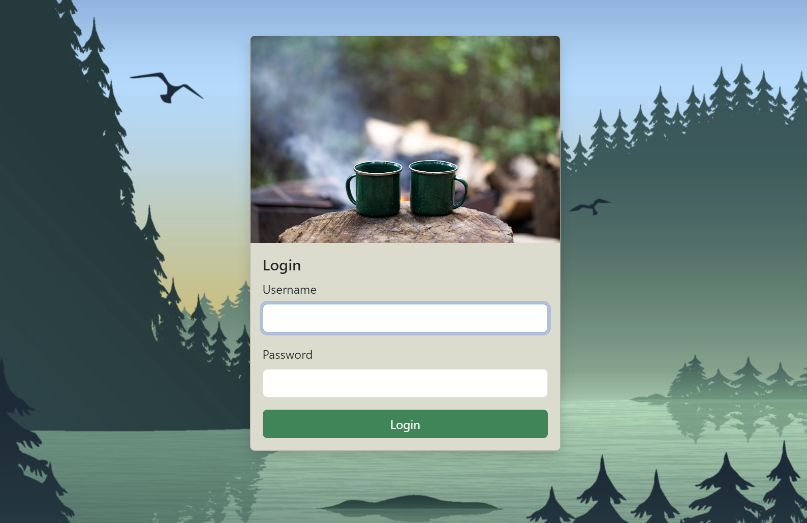
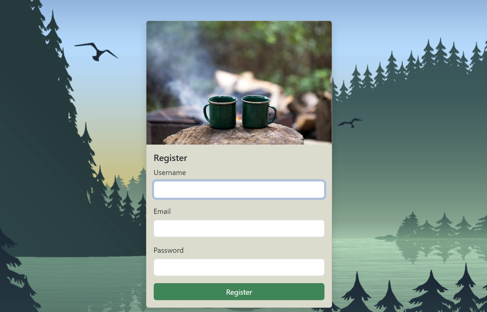

# Campsite

[Campsite](https://campsite-5u82.onrender.com/) is a web application that allows users to browse, create, and review campgrounds. It features full CRUD functionality, user authentication, and authorization, and integrates with various third-party services for enhanced functionality.

## Table of Contents
- [Features](#features)
- [Tech Stack](#tech-stack)
- [Installation](#installation)
- [Usage](#usage)
- [Routes](#routes)
- [Views](#views)
- [Middleware](#middleware)
- [Demo](#demo)
- [License](#license)

## Features

### Campgrounds
- **CRUD Operations**: Create, Read, Update, and Delete campgrounds.
- **Map Integration**: View campgrounds on a map using Mapbox.
- **Star Rating & Reviews**: Add star ratings and reviews to campgrounds.
- **Image Upload**: Upload up to 3 images per campground using Cloudinary.
- **Map Cluster**: Display multiple campground locations in clusters on the map.
- **Pagination & Search**: Smooth user experience with paginated and searchable listings.

### User Management
- **Authentication**: User registration, login, and logout are handled by Passport.js.
- **Authorization**: Protected routes and resources, ensuring only authorized users can perform certain actions.
- **Profile Management**: Update profiles and change passwords.

### Security
- **Data Sanitization**: Prevent injection attacks using `express-mongo-sanitize`.
- **Validation**: Validate data using Joi schemas with HTML sanitization.

### Error Handling
- **404 Error Page**: User-friendly error messages for non-existent routes.

## Tech Stack

### Backend
- **Node.js**: Runtime environment.
- **Express**: Web framework.
- **MongoDB**: NoSQL database.
- **Mongoose**: ODM for MongoDB.
- **Passport.js**: Authentication middleware.
- **Cloudinary**: Image upload and management.
- **Mapbox**: Geolocation and mapping.
- **connect-mongo**: MongoDB session storage.

### Frontend
- **EJS**: Templating engine.
- **Bootstrap**: CSS framework for responsive design.

### Middleware & Libraries
- **express-mongo-sanitize**: Prevent MongoDB injection attacks.
- **Joi**: Data validation.
- **connect-flash**: Flash messages.
- **express-session**: Session management.
- **method-override**: HTTP verbs support (PUT, DELETE).

## Installation

1. **Clone the repository:**
    ```bash
    git clone https://github.com/Daniel-Ho986/campsite.git
    cd campsite
    ```

2. **Install dependencies:**
    ```bash
    npm install
    ```

3. **Environment variables:**
    Create a `.env` file in the root directory and add your configurations:
    ```plaintext
    DATABASE_URL=<Your MongoDB URI>
    CLOUDINARY_CLOUD_NAME=<Your Cloudinary Cloud Name>
    CLOUDINARY_KEY=<Your Cloudinary API Key>
    CLOUDINARY_SECRET=<Your Cloudinary API Secret>
    MAPBOX_TOKEN=<Your Mapbox Token>
    ```

4. **Run the application:**
    ```bash
    npm start
    ```

5. **Access the application:**
    Open your browser and navigate to `http://localhost:3000`.

## Usage

### Routes

- **Campgrounds**: 
  - `GET /campgrounds`: List all campgrounds.
  - `POST /campgrounds`: Create a new campground.
  - `GET /campgrounds/:id`: Show a specific campground.
  - `PUT /campgrounds/:id`: Update a campground.
  - `DELETE /campgrounds/:id`: Delete a campground.

- **Reviews**: 
  - `POST /campgrounds/:id/reviews`: Add a review to a campground.
  - `DELETE /campgrounds/:id/reviews/:reviewId`: Delete a review.

- **User Authentication**: 
  - `GET /register`: Show the registration form.
  - `POST /register`: Register a new user.
  - `GET /login`: Show login form.
  - `POST /login`: Log in a user.
  - `GET /logout`: Log out a user.

## Views

- **Login and Register Pages**: Styled with Bootstrap, includes form validation.
- **Error Page**: Provides a user-friendly 404 error message.
- **Home Page**: Includes navigation links that adjust based on user authentication status.
- **Campgrounds Pages**: Create, view, update, and delete campgrounds.

## Middleware

- **Authentication Checks**:
  - `isLoggedIn`: Ensure the user is logged in.
  - `isAuthor`: Ensure the user is the author of the campground.
  - `isReviewAuthor`: Ensure the user is the review's author.
- **Validation**:
  - Joi schemas with HTML sanitization are used to validate campgrounds and reviews.

## Demo

[](https://youtu.be/bh0noB1EoGs)
Click on the image above to watch a video demonstration of Campsite in action.

#### Campground Listing


#### Login and Registration Pages
<div style="display: flex; gap: 10px;">
    
    
</div>

#### Campground Show Page


## License

This project is licensed under the MIT License.
